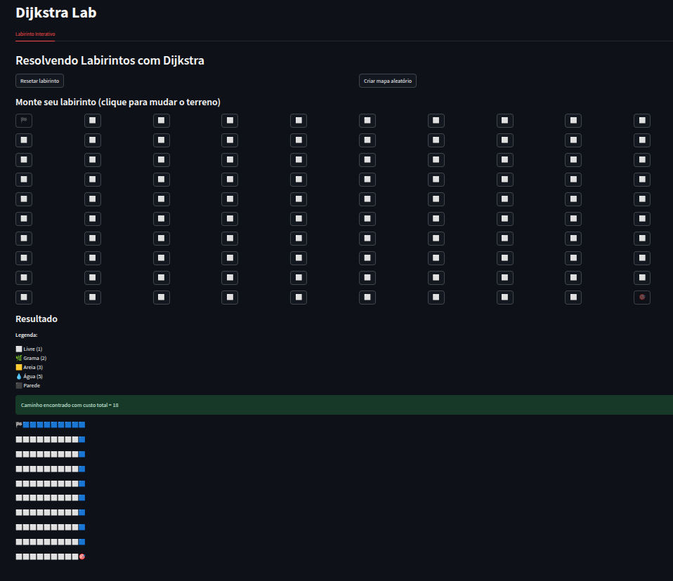
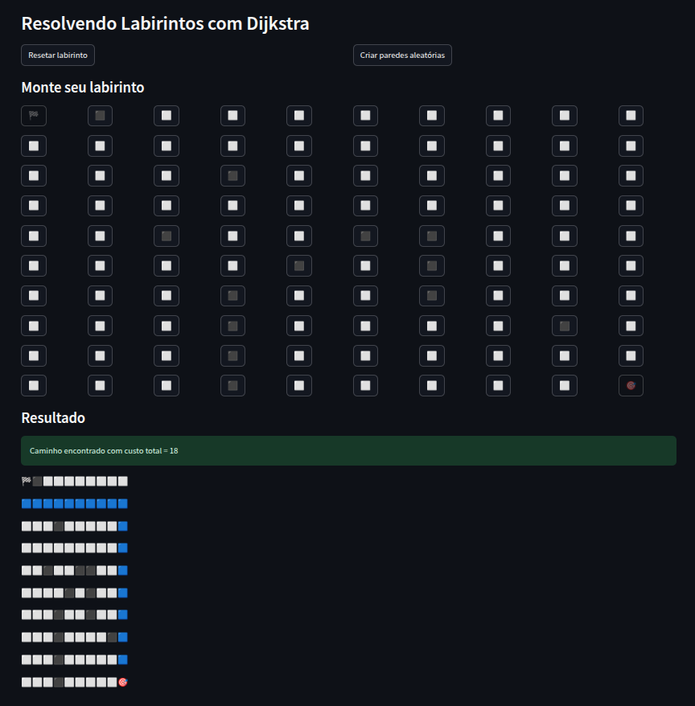
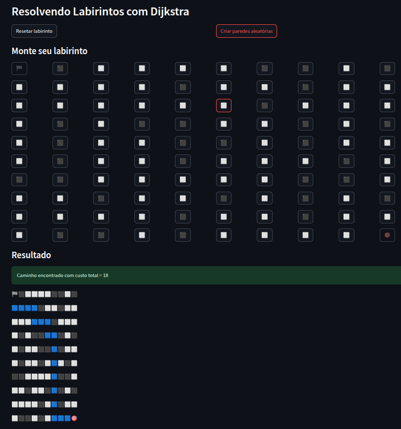
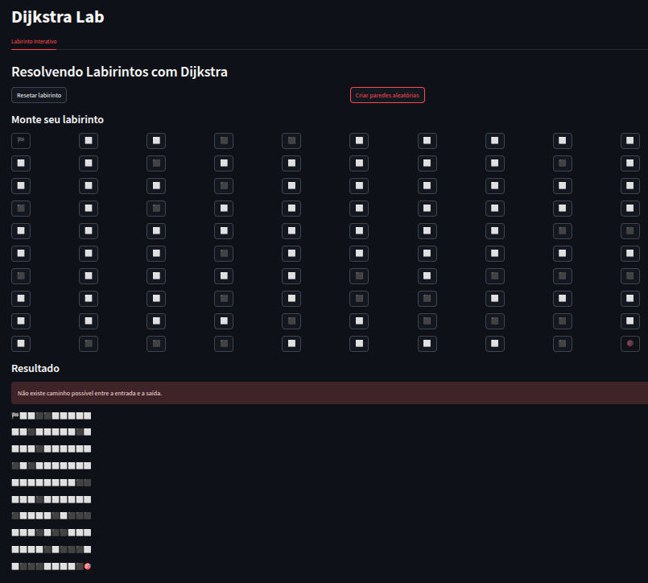

# G14_Grafos_PA-26.1 

Número da Lista: 14<br>
Conteúdo da Disciplina: Grafo<br>
Vídeo da Apresentação: <br>

## Alunos
|Matrícula | Aluno |
| -- | -- |
| 231026840 |  Laryssa Félix |
| 231027005  |  Maria Samara |

---

## Sobre 
Este projeto tem como objetivo demonstrar a aplicação prática de algoritmos de grafos na resolução de problemas reais, utilizando como exemplo a resolução de um labirinto interativo.<br>
O problema do labirinto é modelado como um grafo, onde cada célula livre representa um vértice, e as conexões entre células adjacentes representam arestas com custo unitário. A partir dessa modelagem, é possível aplicar algoritmos de busca para encontrar um caminho entre a entrada e a saída do labirinto. <br>
Além da representação em grafo, o problema também pode ser interpretado como uma busca em árvore implícita. Cada posição no labirinto corresponde a um estado, e os movimentos possíveis geram novos estados, formando uma árvore de exploração. O algoritmo percorre esses estados até encontrar a solução. <br>
Para resolver o problema, foi utilizado o algoritmo de Dijkstra, que é responsável por encontrar o caminho de menor custo entre dois pontos em um grafo com pesos não negativos. No contexto do projeto, cada movimento possui custo 1, permitindo encontrar o menor caminho entre a posição inicial e a saída.
O sistema criado permite ao usuário montar o próprio labirinto de forma interativa e visualizar o caminho encontrado pelo algoritmo, além de informar quando não existe solução possível.

---

## Screenshots

### Labirinto Inicial vazio

Representa o estado inicial do sistema, onde todas as células estão livres. Neste momento, o algoritmo encontra automaticamente o caminho mínimo direto entre o ponto inicial (🏁) e o final (🎯).



### Labirinto com Obstáculos Criados pelo Usuário

Mostra o labirinto após a interação do usuário, onde algumas células foram transformadas em obstáculos (⬛). Isso altera o grafo e força o algoritmo a buscar caminhos alternativos.

 

### Resultado com Caminho Encontrado

Exibe o resultado da execução do algoritmo de Dijkstra, destacando o caminho encontrado (🟦) entre o início e o fim, além do custo total da rota.



### Caso sem Solução

Demonstra um cenário onde não existe caminho possível entre o ponto inicial e o final devido aos obstáculos. O sistema identifica essa condição e informa ao usuário.



---

## Instalação 
Linguagem: python 3.10+<br>
Framework: Streamlit<br>

### Pré-requisitos:
- Python 3 instalado
- pip instalado

### Passos:

Clone o repositório:
```bash
git clone https://github.com/projeto-de-algoritmos-2026/G14_Grafos_PA-26.1
cd G28-Busca-EDA2-26.1
```

Instale as dependências:
```
pip install -r requirements.txt
```

## Uso 

Para executar o projeto, utilize o seguinte comando:
```
streamlit run lab.py
```

### Após executar:

1. O navegador abrirá automaticamente com a interface do projeto.
2. Clique nas células do grid para criar ou remover paredes.
3. O ponto inicial é representado por 🏁 e a saída por 🎯.
4. O algoritmo irá automaticamente calcular o melhor caminho.
5. O caminho encontrado será destacado em azul 🟦.

Observação:
Caso não exista solução, o sistema exibirá uma mensagem de erro.

### Regras do labirinto

- O jogador deve sair do ponto 🏁 e chegar ao ponto 🎯.

- Movimentos permitidos:
    - cima
    - baixo
    - esquerda
    - direita

- Células ⬛ são obstáculos.
- Células ⬜ são caminhos livres.
- Cada movimento tem custo 1.
- O algoritmo busca o menor caminho possível.
- O início e o fim não podem ser bloqueados.

## Justificativa do algoritmo

O algoritmo de Dijkstra foi escolhido por ser adequado para encontrar caminhos mínimos em grafos com pesos não negativos. Mesmo em um cenário simples, como o labirinto, ele garante que o caminho encontrado seja o de menor custo. Embora a implementação utilize grafos, o problema também pode ser interpretado como uma busca em árvore. Cada posição no labirinto representa um estado, e cada movimento gera novos estados possíveis. Assim, a exploração do labirinto corresponde à expansão de nós em uma árvore de busca.

## Estrutura do Projeto

```bash
G28-Busca-EDA2-26.1/
├── lab.py         # Interface interativa do projeto  
├
├── logic.py       # Implementação do algoritmo de Dijkstra.
                   # Contém a lógica de busca no grafo, cálculo das distâncias mínimas
                   # e reconstrução do caminho entre o ponto inicial e o final.